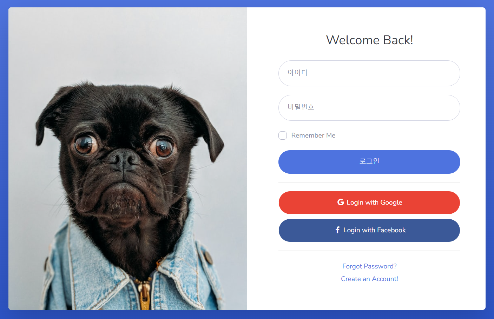
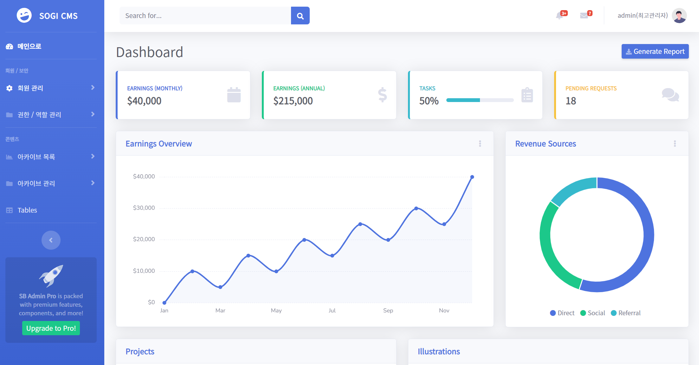

# Sogi_cms

웹 리리자단 CMS 토이프로젝트 **'서기CMS'**

스프링부트로 개발된 해당 프로젝트는 Thymeleaf를 뷰템플릿으로 사용해 개발되었으며 사용자단의 경우 REST API를 통해 프론트와 백 서버를 각각 분리하는 것이 가능하다.

## 기술스택

* Spring Boot
* MariaDB
* Thymeleaf
* JPA / QueryDSL

## 캡처 화면

(스킨은 SB Admin Pro 스킨을 유료로 구매해 사용하였다.)

### 🕺🏻관리자 로그인 페이지


### 🕺🏻 관리자 화면 메인 페이지

(화면의 통계자료의 경우 html과 css만으로 만들어진 빈 자료이다. 아직 구현되지 않았음.)

## 구현된 기능들

### 회원 관리 기능
* 회원에 대한 CRUD 기능이 구현되었다. 회원은 관리자단에서 관리자, 일반 회원에 따라 분기되어 노출될 수 있으며 관리자는 회원에 대한 정보값을 수정하거나 회원의 휴면, 탈퇴처리를 승인/취소할 수 있다.
* 회원의 민감정보의 경우 스프링 시큐리티의 암호화 구현체를 이용해 서버 상에서 암호화 해 데이터베이스 시스템에 저장된다. 모든 암호화 로직은 서버에 탑재되어 있기 때문에 데이터베이스의 sql은 암호화에 대한 작업에 일절 관여하지 않는다.
* 로그인의 경우도 spring security에서 지원받을 수 있는 부분이 있기 때문에 AuthenticationProvider 인터페이스를 구현해 로그인 로직으로 사용하였다.
```java
public class UserFormAuthenticationProvider implements AuthenticationProvider {
    
    ...

    @Override
    public Authentication authenticate(Authentication authentication) throws AuthenticationException {
        String approachedUsername = authentication.getName();
        String approachedPassword = (String) authentication.getCredentials();

        UserDetails userDetails = userDetailsService.loadUserByUsername(approachedUsername);

        if (!userDetails.isEnabled()) {
            throw new BadCredentialsException("인증 정보가 올바르지 않습니다.");
        }

        if (!passwordEncoder.matches(approachedPassword, userDetails.getPassword())) {
            throw new BadCredentialsException("인증 정보가 올바르지 않습니다.");
        }

        return new UsernamePasswordAuthenticationToken(
                userDetails.getUsername(),
                userDetails.getPassword(),
                userDetails.getAuthorities());
    }
    
    ...
}
```

### 권한/역할 기능
* 관리자 혹은 일반 회원에 대한 여러 권한과 역할을 생성하고 제어하는 CRUD 기능이 구현되어 있다. 역할과 권한은 Spring Security에 의해 구현되었고 관리자는 관리자단에서 권한을 생성한 후 역할에 권한들을 추가, 삭제할 수 있다.
* 인증과 인가처리와 같은 보안 기능 같은 경우 당초 프로젝트에서 계획했던 프론트와 백서버의 분리라는 기조에 따라 관리자와 일반회원의 인증/인가 처리가 별도로 진행될 수 있도록 구현했다. 
* 인가처리의 경우 데이터베이스 관리자가 데이터베이스 시스템에 권한/역할 기능을 추가/삭제하고 이러한 부분들이 실시간으로 프로젝트 내부의 인가 정책에 반영이 되어야 하므로 스프링 시큐리티의 FilterInvocationSecurityMetadataSource 인터페이스를 구현해 회원의 인가처리가 필요할 때 데이터베이스 시스템의 인가 데이터를 가져오는 로직을 작성하였다. 그리고 해당 인가 데이터를 서버의 메모리 상에 저장해 회원의 요청이 있을 때마다 데이터베이스에 인가 정보를 요청하는 일이 없도록 했다.
```java
public class UrlFilterInvocationSecurityMetadataSource implements FilterInvocationSecurityMetadataSource {

    ...
    
    @Override
    public Collection<ConfigAttribute> getAttributes(Object object) throws IllegalArgumentException {
        // Object = MethodInvocation
        HttpServletRequest request = ((FilterInvocation) object).getRequest();

        if (isInWhiteList(request)) {
            return null;
        }

        if (resourceMap == null) {
            resourceMap = authorityService.getResourceMap();
        }

        for (Map.Entry<RequestMatcher, List<ConfigAttribute>> entry : resourceMap.entrySet()) {
            RequestMatcher requestMatcher = entry.getKey();
            if (requestMatcher.matches(request)) return entry.getValue();
        }

        return null;
    }
    
    ...
}
```
```java
public class AuthorityServiceImpl implements AuthorityService {

    ...

    @Override
    public LinkedHashMap<RequestMatcher, List<ConfigAttribute>> getResourceMap() {
        LinkedHashMap<RequestMatcher, List<ConfigAttribute>> resourceMap = new LinkedHashMap<>();
        authorityRepository.findAll()
                .forEach(authority -> {
                    ArrayList<ConfigAttribute> configAttributeList = new ArrayList<>();

                    authority.getRoleAuthorityList()
                            .forEach(roleAuthority -> {
                                Role role = roleAuthority.getRole();
                                configAttributeList.add(new SecurityConfig(role.getRoleName()));
                            });

                    resourceMap.put(
                            new AntPathRequestMatcher(authority.getUrlPath()),
                            configAttributeList);
                });

        return resourceMap;
    }
    
    ...
}
```

### 아카이브(게시판) 기능
* 관리자에 의해 작성되는 게시판인 아카이브를 관리자단에서 생성할 수 있다. 아카이브는 등록/수정할 때 템플릿을 적용할 수 있어 템플릿을 어떻게 적용하느냐에 따라 회원단으로 보여지는 뷰의 모양을 조정할 수 있다. 
* 아카이브의 경우 아카이브의 기본 포맷을 데이터베이스에 적용해 둠으로써, 게시판을 제작해야 할 때 일일히 CRUD 로직을 만들어야 하는 번거로움을 피하고자 하였다. 따라서 아카이브의 기본적인 포맷을 공유하는 게시판의 경우 아카이브 로직의 CRUD 로직을 그대로 사용하며 사용자에게 보여주는 뷰와 게시판을 생성할 때 사용되는 form 태그가 있는 뷰만 템플릿으로 따로 적용하면 되도록 코딩했다.
```java
@Override
public class ArchiveCategoryServiceImpl implements ArchiveCategoryService {
    
    ...

    public Long saveArchiveCategory(ArchiveCategoryCreateUpdateDto archiveCategoryDto) {

        initializeArchiveCategorySkins(archiveCategoryDto);
        initializePageSizeAndSortDirection(archiveCategoryDto);

        ArchiveCategory archiveCategory = ArchiveCategory.create(archiveCategoryDto);

        archiveCategoryRepository.save(archiveCategory);

        return archiveCategory.getId();
    }

    private void initializePageSizeAndSortDirection(ArchiveCategoryCreateUpdateDto archiveCategoryDto) {
        if (archiveCategoryDto.getPageSize() == null) {
            archiveCategoryDto.setPageSize(10);
        }

        if (archiveCategoryDto.getSortDirection() == null) {
            archiveCategoryDto.setSortDirection(SortDirection.DESC);
        }
    }

    private void initializeArchiveCategorySkins(ArchiveCategoryCreateUpdateDto archiveCategoryDto) {
        if (!StringUtils.hasText(archiveCategoryDto.getAdminFormSkin())) {
            archiveCategoryDto.setAdminFormSkin("form.html");
        }

        if (!StringUtils.hasText(archiveCategoryDto.getAdminListSkin())) {
            archiveCategoryDto.setAdminListSkin("list.html");
        }

        if (!StringUtils.hasText(archiveCategoryDto.getUserListSkin())) {
            archiveCategoryDto.setUserListSkin("list.html");
        }

        if (!StringUtils.hasText(archiveCategoryDto.getUserDetailSkin())) {
            archiveCategoryDto.setUserDetailSkin("detail.html");
        }
    }
            
    ...
}
```

### 파일 시스템 기능
* 회원의 프로필 사진 등을 데이터베이스 시스템에 저장할 수 있는 기능이 구현되어 있으며 pdf, img 등의 미디어 파일을 아카이브와 연동하여 다운로드 받을 수 있는 기능이 구현되어 있다.

